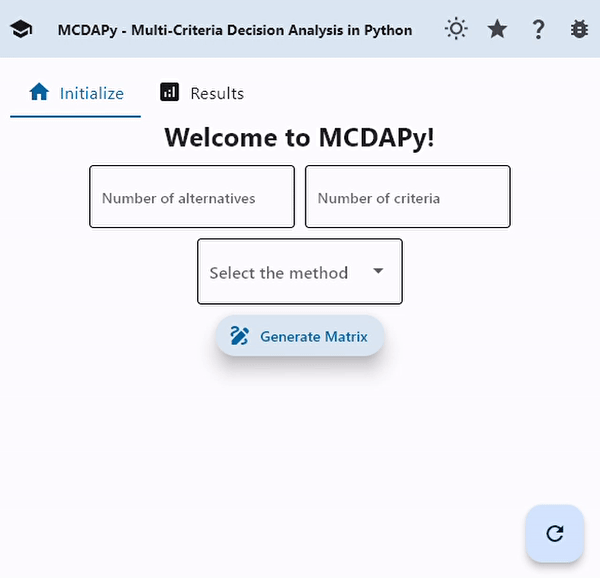

# mcdapy

A simple application for **Multiple-criteria decision analysis (MCDA)** in python.

Powered by the [Flet](https://flet.dev/) package, which allows creating flutter applications totally on python.

Two methods are currently implemented: PATTERN and [ELECTRE](https://doi.org/10.1016/j.ejor.2015.07.019).

The usage of the application is very simple, just enter the data and the method you want to use, and the application will return the results.




# Installation

```bash
pip install mcdapy
```

# How to use

### Python script

```python
import mcdapy

app = mcdapy.App()
```

### Terminal

```shell
python cli.py
```

### Executable

```shell 
python pyinstaller --onefile cli.py --name mcdapy
```

# Directory structure

```shell
mcdapy
├── mcdapy
│   ├── methods
│   │   ├── __init__.py
│   │   ├── pattern.py
│   │   ├── electre.py
│   ├── __init__.py
│   ├── app.py
├── examples
│   ├── methods.ipynb
│   ├── e1.gif
├── cli.py
├── README.md
├── LICENSE
├── requirements.txt
├── requirements-dev.txt
├── setup.py
```

# Contributing

Pull requests are welcome. For major changes, please open an issue first to discuss what you would like to change.

You can also raise an issue if you find any bug or have any suggestion.
